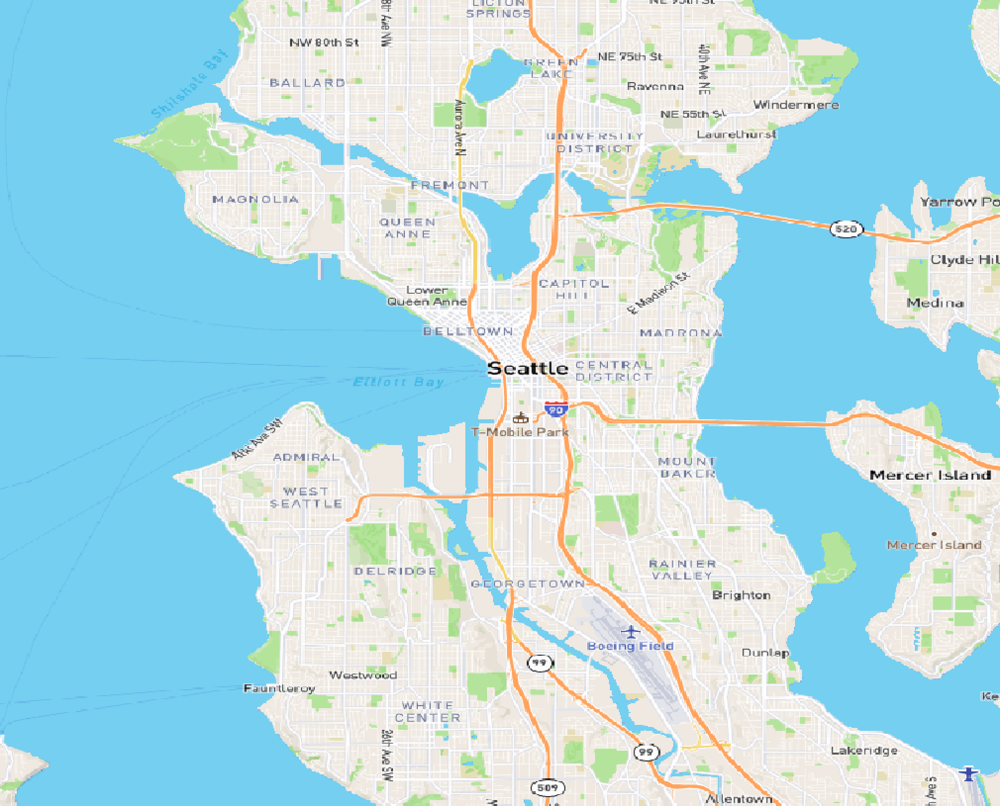
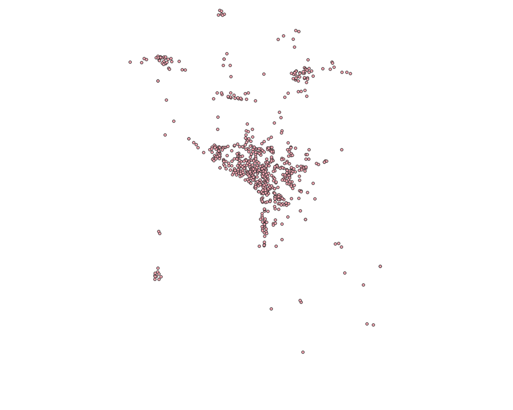
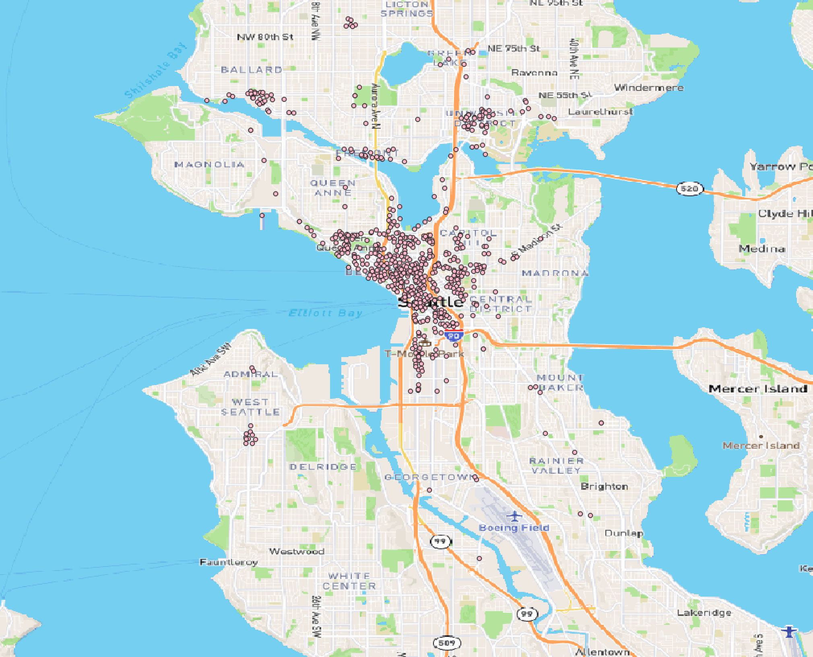
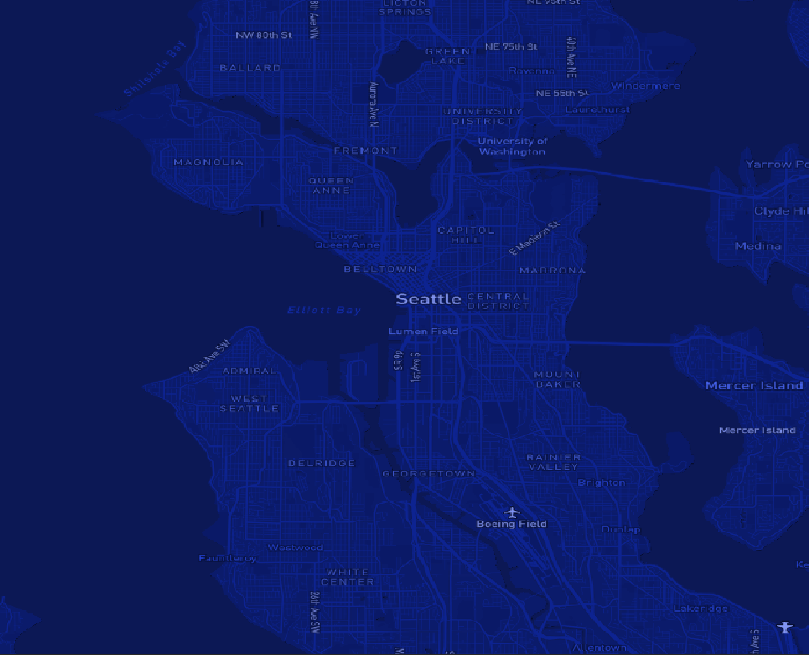

# Mapbox Tiles of Parking in Seattle

Map url:[fr4nk-w1n5.github.io/geog458_lab4/index.html](https://fr4nk-w1n5.github.io/geog458_lab4/index.html)

## Introduction

The geographic area I am examining for this lab is the city of Seatle. The tile sets I have made are focused on parking garages which can show where the more popular areas of the city are located. 

Sidenote: I ran into some issues when working on this lab so the screenshots shown are from QGIS and display how the tile sets are supposed to look like. I think the problem was when generating the tilesets using the QGIS plugin. 

The first tile set is the streets basemap from mapbox centered around Seattle. Zoom levels for this set are 1 to 11.

The second tile set is the parking garages in and near Seattle. Zoom levels for this set are 1 to 11.

The third tile set is the parking garages and the streets basemap combined.  Zoom levels for this set are 1 to 11.

the final tileset is the monochrome basemap from mapbox that I customized to have a dark blue color to it.  Zoom levels for this set are 1 to 11.

## Sources

The basemaps are from [mapbox studio](studio.mapbox.com). The parking data is from [Seattle GeoData](https://data-seattlecitygis.opendata.arcgis.com/datasets/SeattleCityGIS::public-garages-or-parking-lots/explore). Tile sets were created from [QGIS](https://www.qgis.org/en/site/).

